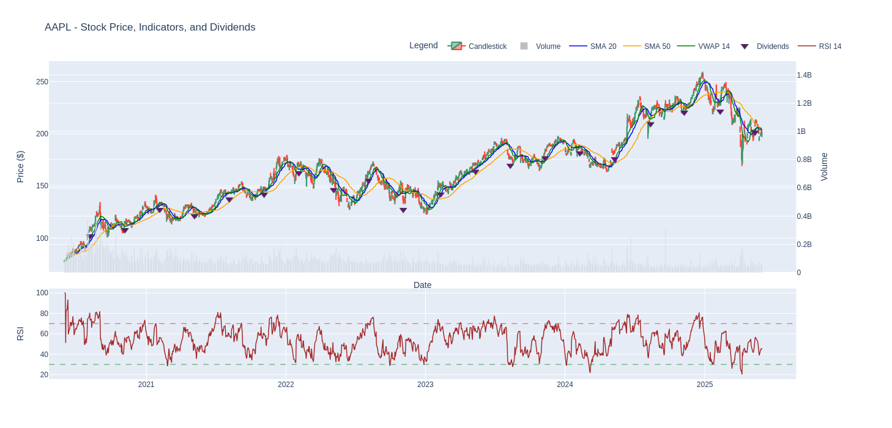

# Stock Performance Visualizer & Comparator
[](https://colab.research.google.com/drive/1e3GlxggYKWNx7pC7jHqBKuwr3ql5Hrku#scrollTo=4J7wXpBBf2Ru)


## Brief Description

This project aims to fetch historical data for several stocks (specifically 5 major US stocks along with the S&P 500 ETF - SPY), visualize their prices and technical indicators, and compare their price performance over a specific period. The main visualization focuses on comparing the percentage price change to see how each stock has performed relative to one another and to the market (SPY).

## Main Features

* **Stock Data Fetching:** Retrieves historical stock price data (OHLCV - Open, High, Low, Close, Volume), dividends, and other information using `yfinance`.
* **Technical Indicator Calculation:** Calculates various technical indicators such as Simple Moving Average (SMA), Relative Strength Index (RSI), and Volume Weighted Average Price (VWAP) using the `ta` library.
* **Individual Data Visualization:** Creates interactive candlestick charts for each stock, complete with volume and selected technical indicators. Uses `Plotly` for interactive and engaging visualizations.
* **Performance Comparison:** Generates a line chart comparing the percentage price change of several stocks and SPY over a specified time period (e.g., the last 5 years) for relative performance analysis.
* **Interactivity:** The generated charts allow for zooming, panning, and displaying details on hover.

## Technology & Tools Used

* **Python:** Main programming language.
* **Jupyter Notebook/Google Colab:** Interactive development environment.
* **`yfinance`:** For fetching historical market data from Yahoo Finance.
* **`pandas`:** For data manipulation and analysis.
* **`ta`:** Library for technical analysis, used for calculating indicators.
* **`plotly`:** For creating interactive and dynamic data visualizations.

## Setup & Installation

1.  **Clone the Repository (if already uploaded to GitHub):**
    ```bash
    git clone https://github.com/Aryamuda/Stock-and-Performance-Visualizer-.git
    cd Stock-and-Performance-Visualizer-
    ```

2.  **Create and Activate Virtual Environment (Recommended):**
    ```bash
    python -m venv venv
    # Windows
    venv\Scripts\activate
    # macOS/Linux
    source venv/bin/activate
    ```

3.  **Install Dependencies:**
    ```bash
    pip install yfinance pandas ta plotly matplotlib # Add other libraries if any
    ```
    *(Note: `matplotlib` might already be installed as a dependency of `plotly` or `mplfinance` if you used it.)*

## Usage

1.  Open the main Jupyter Notebook file (e.g., `5_Stock_And_Comparison_Performance_With_ETF_SNP500_.ipynb`) in Jupyter Notebook, JupyterLab, or Google Colab.
2.  Ensure you have an internet connection to fetch stock data.
3.  Run the notebook cells sequentially.
4.  Interactive charts will be displayed as output from the relevant cells.

## Visualization Examples

**Example Candlestick Chart with Indicators:**


**Example Performance Comparison Chart:**


## To-Do / Future Enhancements

* [ ] Add more options for technical indicators.
* [ ] Allow users to dynamically input a list of stock tickers.
* [ ] Create a simple user interface (GUI) using Streamlit or Dash.
* [ ] Save configurations and analysis results.
* [ ] Add further statistical analysis.

## Contributing

Contributions, issues, and feature requests are welcome! Please open a new *issue* to discuss changes you would like to make or a *pull request* if you already have a fix.
